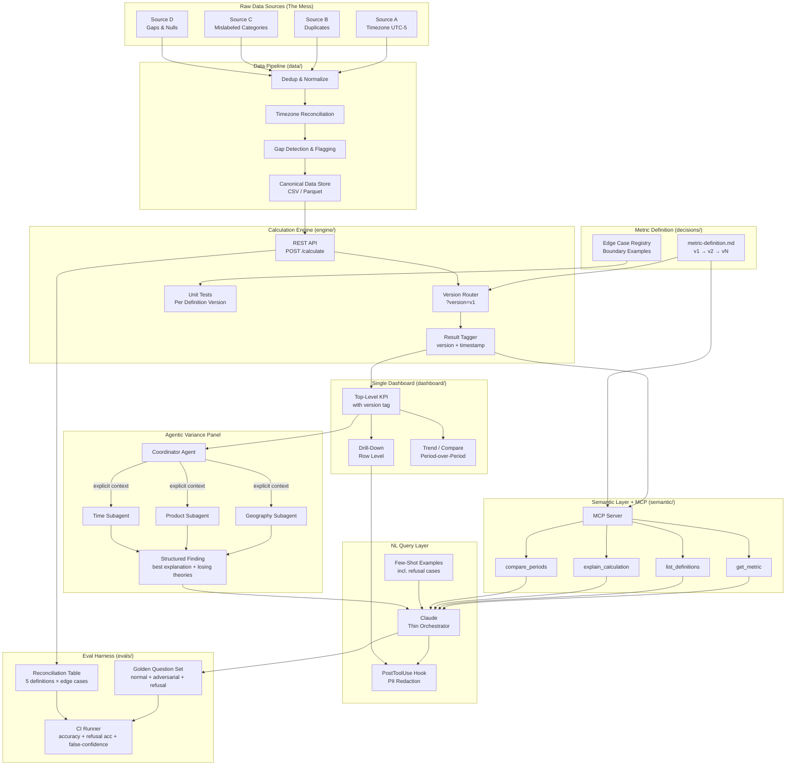

# System Architecture: One Metric, One Answer

## Overview

Four stakeholder groups each calculate the same metric differently. This system imposes a single authoritative definition, makes it versioned and executable, exposes it through a semantic layer, and surfaces it through one dashboard and a natural-language query interface.

## Architecture Diagram

## Layer Descriptions

### Raw Data Sources
Four systems feed the pipeline. Each has a distinct data quality problem: timezone offset, duplicate records from retry storms, mislabeled categories, and sparse/null gaps.

### Data Pipeline (`data/`)
Normalizes inputs to a canonical store. Dedup is deterministic (last-write-wins with source priority). Timezone reconciliation converts to UTC. Gaps are flagged, not silently filled — the metric engine decides how to handle them.

### Metric Definition (`decisions/metric-definition.md`)
The single authoritative definition, versioned as `v1`, `v2`, etc. Every assumption is explicit with numeric thresholds. No vague modifiers. Every downstream result carries the version that produced it.

### Calculation Engine (`engine/`)
A REST API that executes the metric definition as code. `?version=vN` selects the definition version. Results are tagged `{value, version, computed_at}`. Each version has its own unit test suite so regressions are caught per-version.

### Semantic Layer + MCP Server (`semantic/`)
Four tools expose the engine to Claude sessions:
- `get_metric` — compute the metric for a time range and filters
- `list_definitions` — enumerate available definition versions with summaries
- `explain_calculation` — return the human-readable rationale for a specific result
- `compare_periods` — diff two time periods with attribution

A fresh Claude session should reach for one of these four tools first. Tool descriptions explicitly state what each tool does *not* do.

### NL Query Layer
Claude acts as a thin orchestrator over the MCP tools. Few-shot examples include at least one refusal case (a question the data genuinely cannot answer). A `PostToolUse` hook redacts PII deterministically from drill-down rows before they are returned — this is a hard guardrail, not a prompt instruction.

### Single Dashboard (`dashboard/`)
One view with three levels: top-level KPI (tagged with definition version), drill-down to operator-actionable rows, and period-over-period trend. Replaces all 40 legacy dashboards.

### Eval Harness (`evals/`)
- **Golden question set** — covers normal, adversarial, and refusal cases
- **Reconciliation table** — rows are edge cases, columns are the five competing definitions
- **CI runner** — accuracy, refusal accuracy, false-confidence rate; stratified by question type; runs on every semantic-layer change

### Agentic Variance Panel (stretch)
When the metric moves unexpectedly, a coordinator spins up three parallel Task subagents. Each receives explicit context (subagents don't inherit coordinator state). Geography, product, and time subagents each return a structured finding. The coordinator surfaces the best explanation and the losing theories — not just the winner.

## Key Design Decisions

| Decision | Choice | Rationale |
|---|---|---|
| Definition versioning | Semver tags in filename | Every result must be traceable to the exact rule that produced it |
| PII redaction | `PostToolUse` hook | Deterministic; cannot be overridden by a prompt |
| MCP tool count | 4 tools | Reliability drops past ~5 tools per agent |
| Subagent context | Explicit per-call | Subagents don't inherit coordinator context |
| Reconciliation table priority | Above dashboard polish | This artifact wins the stakeholder room |

Full ADRs for each decision live alongside this file in `decisions/`.
